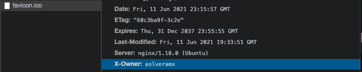

# Entrega de practica #9 módulo DevOps

### Despliegue react_app

#### Enlace del repo desplegado

https://github.com/aolveramx/practica6_react_wallafake

_Únicamente la carpeta "client" en producción sin back-end._

```
https://react.ariolvera.com/login
```

### Despliegue node_app

#### Enlace del repo desplegado

https://github.com/aolveramx/practica7_nodejs_avanzado

```
https://node.ariolvera.com/
```

#### Archivo cabecera x-owner


